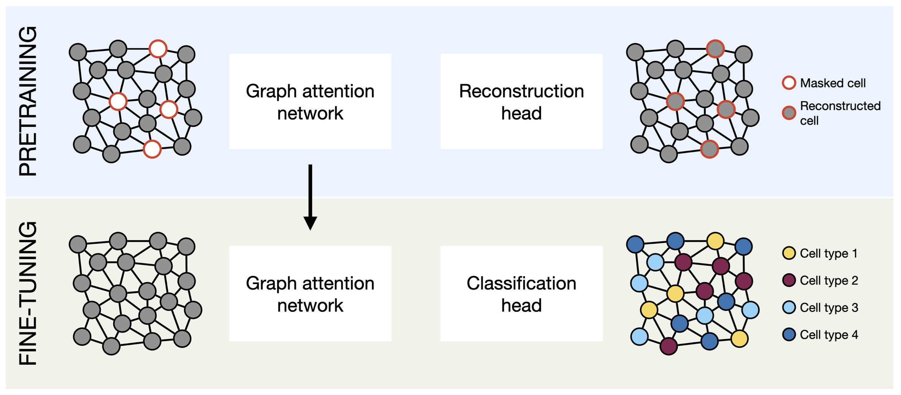

# SpatialSSL: Whole-Brain Spatial Transcriptomics in the Mouse Brain with Self-Supervised Learning (NeurIPS 2023 AI for Science Workshop)

Link to full paper:
https://openreview.net/forum?id=bfD3Fzy7Mb

### Authors

- Till Richter
- Anna Schaar
- Francesca Drummer
- Cheng Wei
- Leopold Endres
- Fabian Theis

## Visual Abstract



## Introduction

SpatialSSL is a research project that explores different methods of self-supervised learning applied to spatial
transcriptomics data in the mouse brain. Self-supervised learning is a type of machine learning where models are trained
to predict certain aspects of the data without explicit human annotations. The project focuses on modeling spatial data
as graphs and applying graph-based machine learning and pretraining methods. The goal of this project is to analyse how
different pretrained models perform on downstream tasks.

### Provided Data

The dataset used in SpatialSSL leverages the BICCN 2.0 [[1]](#1) dataset, which contains spatial data of approximately 4 million
brain cells, measuring the expression of 550 genes. Spatial transcriptomics data combines positional information (
usually in the form of x-y coordinates) with gene expression for each cell. The dataset is organized into 59 "images,"
each containing spatially independent cells. Depending on the annotation levels, there are 15, 30, or 35 different cell
types present.

### Dataset Construction - Two Methods

1. **Create Single Graph for Each Image in the Dataset:**
    - Parameters: Radius, threshold distance between cells to draw edges between them.
    - This method results in relatively large graphs spanning from 30k to 60k nodes.

2. **Splicing Graphs into Subgraphs Using Egonet of Each Node:**
    - Parameters: Radius, threshold distance between cells to draw edges between them; k_hop: the number of "hops" for
      subgraph creation.
    - This method results in approximately 4 million small graphs, with the size depending on the radius and k_hop
      parameters.

### Masking Techniques for Pretraining

For both datasets, several masking methods were explored during the pretraining phase:

- Masking all gene expression values of 20% of cells.
- Masking specific cell types.

In the final experiments, we masked all gene expression values of 20% of cells.

### Pretraining

Pretraining of the models was performed using graph neural networks with graph attention and convolution. The task was to reconstruct the masked gene expression values. 


### Downstream Task: Cell Type Prediction

SpatialSSL develops various models, including both pre-trained models and models that are not pre-trained. Pre-trained weights are utilized for fine-tuning the model specifically for cell type prediction. Subsequently, the performance of these models is assessed in the context of predicting cell types based on gene expression values.

## Citation

If you use this code or our paper in your research, please cite the following paper:
```
@inproceedings{
   richter2023spatialssl,
   title={Spatial{SSL}: Whole-Brain Spatial Transcriptomics in the Mouse Brain with Self-Supervised Learning},
   author={Till Richter and Anna Schaar and Francesca Drummer and Cheng-Wei Liao and Leopold Endres and Fabian Theis},
   booktitle={NeurIPS 2023 AI for Science Workshop},
   year={2023},
   url={https://openreview.net/forum?id=bfD3Fzy7Mb}
}
```

## References
<a id="1">[1]</a> 
Zhang M, Pan X, Jung W, Halpern A, Eichhorn SW, Lei Z, Cohen L, Smith KA, Tasic B, Yao Z, Zeng H, Zhuang X. A molecularly defined and spatially resolved cell atlas of the whole mouse brain. bioRxiv [Preprint]. 2023 Mar 7:2023.03.06.531348. doi: 10.1101/2023.03.06.531348. PMID: 36945367; PMCID: PMC10028822.
